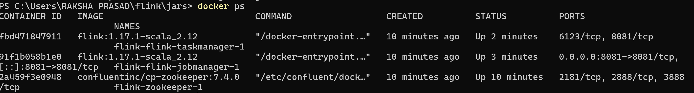
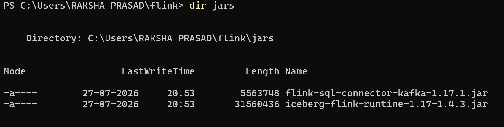

# IceStream-Flink

Real-time streaming pipeline using Apache Flink + Kafka + Apache Iceberg

## Project Details
This project demonstrates streaming data from Kafka into Iceberg tables using Flink SQL.

## Screenshots

### 1. Docker Containers Running
`docker ps` output showing Kafka, Zookeeper, Flink, MinIO

### 2. Flink Lib Jars
Jars folder with Iceberg and Kafka connectors

## Tech Stack
- Apache Kafka + Zookeeper 
- MinIO S3
- Docker Compose
-  **Apache Flink**: 1.19.1
- **Apache Iceberg**: 1.7.1 
- **Catalog**: Hadoop Catalog with local warehouse
- **Java**: 17+

## Files
- `docker-compose.yml` : Kafka, Zookeeper, Flink, MinIO setup
- `iceberg.sql` : All Flink SQL commands for source, sink and queries
- `jars/` : Required Flink Iceberg and Hadoop jars

## How to Run
1. Start services: `docker compose up -d`
2. Open Flink SQL: `docker exec -it jobmanager ./bin/sql-client.sh`
3. Execute all SQL from `iceberg.sql`

## Key Fix
Fixed Kafka `advertised.listeners=kafka:9092` for internal Docker networking.

## 📁 Repo Structure
IceStream-Flink/
├── conf/
│   └── demo-catalog.yaml # Iceberg catalog config
├── docker-compose.yml # Flink + Kafka setup
├── kafka-compose.yml # Kafka standalone setup
├── iceberg.sql # Sample Iceberg DDL/DML
└── README.md

# Test Iceberg Catalog
SQL 
SHOW CATALOGS;
USE CATALOG demo;
SHOW DATABASES;
SHOW TABLES;

# With Docker + Kafka
docker compose -f docker-compose.yml up -d
docker compose -f kafka-compose.yml up -d

# Config Details
conf/demo-catalog.yaml uses Hadoop Catalog:
catalogs:
    - name: demo
    type: iceberg
    catalog-type: hadoop
    warehouse:./warehouse
    property-version: 1

